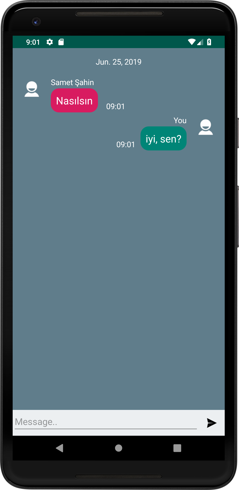
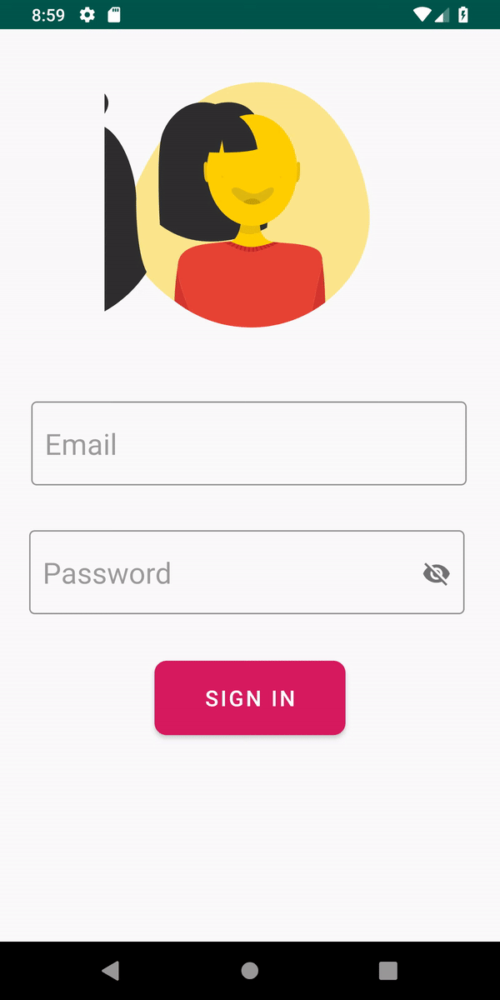
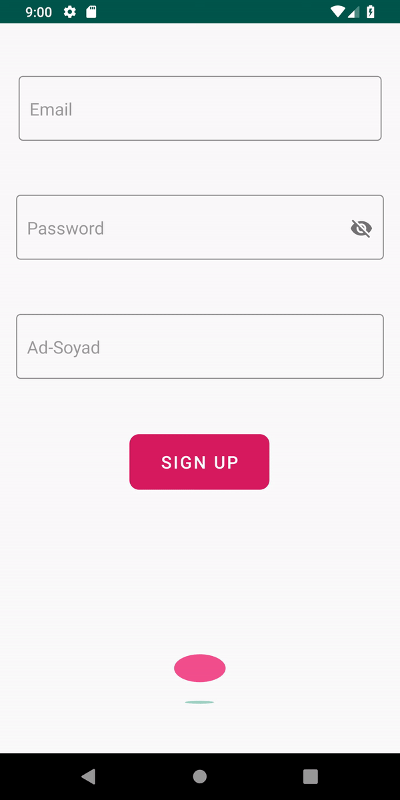

# Vatsap
Firebase ve çeşitli kütüphaneler kullanarak oluşturduğum bir android chat uygulaması

## Kulandığım kütüphaneler ve Firebase sistemleri:
* [Firebase Auth](https://firebase.google.com/)
* [Firebase Realtime Database](https://firebase.google.com/)
* [Lottie](https://github.com/airbnb/lottie-android)
* [ChatView](https://github.com/bassaer/ChatMessageView)

  

  
  
  

